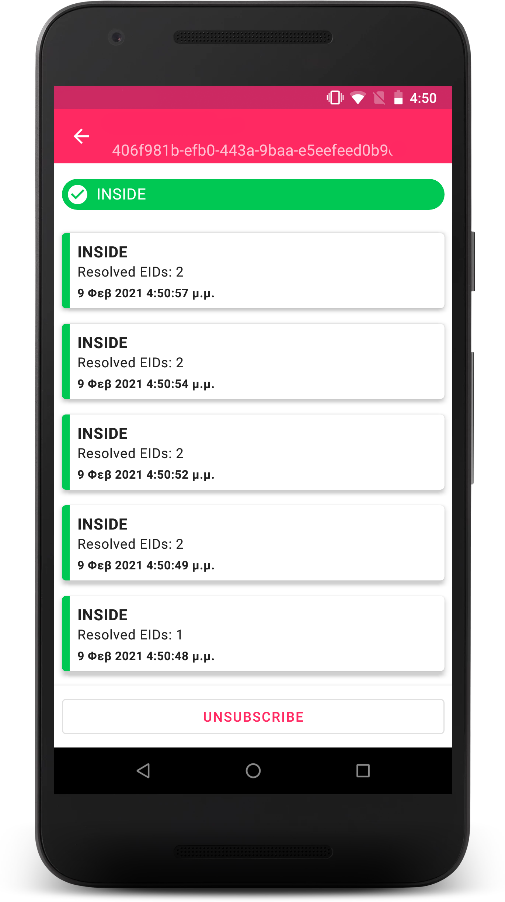

# Bespot Android SDK

[](#)
[](#)



Bespot Android SDK offers indoor location tracking and analytics reporting to 3rd party apps using BLE technology and Machine Learning.

## Features

- [x] Indoor location (in/out)
- [ ] Indoor area detection
- [ ] Outdoor location
- [ ] Analytics

## Installation

Add the Bespot Artifactory repository to your root `build.gradle`.

```gradle
allprojects {
    repositories {
        maven {url 'https://bespot.jfrog.io/artifactory/bespot-sdk-android/'}
    }
}
```

And then add the dependency in your project's `build.gradle`:

```gradle
dependencies {
    implementation "com.bespot:library:${latest_version}"
}
```

## Usage

First initialise Bespot SDK with the provided **App Id** and **App Secret**
```kotlin
Bespot.init(this, "your_app_id", "your_secret", null)
```

The Bespot SDK requires three permissions. It needs permission for [Fine Location](https://developer.android.com/reference/android/Manifest.permission#ACCESS_FINE_LOCATION), for [Bluetooth](https://developer.android.com/reference/android/Manifest.permission#BLUETOOTH) and for [Bluetooth Admin](https://developer.android.com/reference/android/Manifest.permission#BLUETOOTH_ADMIN).

#### Subscribe for indoor location events

In order to receive indoor location changes you need to subscribe to `Bespot.subscribe`. This will return a 'StatusResult' object with the status of the device.

```kotlin
Bespot.subscribe(object: StatusObserver {
    override fun onStatusUpdate(status: StatusResult) {
        // Handle new status
    }

    override fun onError(error: Failure) {
        // Handle error
    }
}, null, null)
```

For the unsubscribe procedure use the `Bespot.unsubscribe`

```kotlin
 override fun onPause() {
        Bespot.unsubscribe()
        super.onDestroy()
    }
```

####  Failures

Every `Observer` or `Callback` class has an `onError(error: Failure)` callback method that retrieves an `Failure` object.
Check the error type by using the below structure:

```kotlin
when (error) {
        is StatusFailure.NoConfigurationFound -> // No Configuration Found
        is StatusFailure.NoStoreReadings -> // No Store Readings
        is StatusFailure.CloseDistance -> // Close Distance"
        is StatusFailure.IndoorDataModelNotFound -> // Indoor data model Not found
        // Add all the Failure Cases
        else -> // Unhandleable error
    }
```

## License

(C) Copyright 2020-2021 Bespot P.C. All rights reserved. See `LICENSE` for more information.
